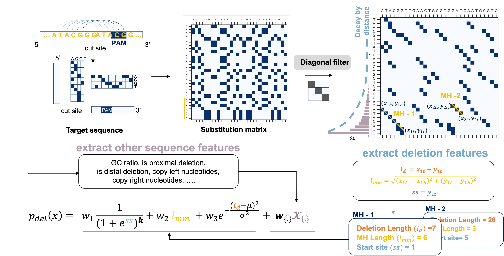

# ***inDecay*** : *Predicting CRISPR-induced <ins>in</ins>dels by frequency <ins>Decay</ins>*

This library provides the inDecay package, the script for using our model to predict indels for your own input sequence, the script for training, finetuning the inDecay model.


## Understand the workflow of inDecay  
We provide a demonstrating notebook ([demo/inDecay_demo.ipynb](https://github.com/StatBiomed/inDecay/blob/main/demo/inDecay_demo.ipynb)) containing the most necessary code to re-implement the inDecay work flow. You can follow the demo to get an idea of how the features were extracted and designed. It also records the a simplified inDecay model and the training process using `pytorch_lightning` `Trainer`.  

  


&nbsp;  
To unlock the full power of inDecay, please follow the installation and training steps below.
&nbsp;  

## Installation  
To run inDecay model, please install the package by 
```shell
git clone https://github.com/StatBiomed/inDecay.git
cd inDecay

# create an new environment and install the dependencies
conda env create -n inDecay python=3.10.4 pip

# install the python package
conda activate inDecay
pip install -r requirements.txt
pip install -e ./  
```
&nbsp;  

And we also encourage users to install indelgen toolkits from SelfTarget(https://github.com/felicityallen/SelfTarget).

```shell
conda activate inDecay

cd ../
git clone https://github.com/felicityallen/SelfTarget.git
cd SelfTarget
# the python dependent
pip install -r requirements.txt
cd selftarget_pyutils
pip install -e .
cd ../indel_prediction
pip install -e .
```
&nbsp;

## Data download
To get the data for re-producing the model or developing related tools, you can easily download the processed data via
```shell
cd ../../inDecay
bash scripts/Data_download.sh
```

The script will ask for the directory to place the data. You the script will create the folder if not existed. An example below:

```shell
bash scripts/Data_download.sh
[out] Enter the a path where you want to save the data: 
[in] data 
```

## Set up PATH.py
After you have downloaded the data and install the SelfTarget toolkits, please runn the following script under the main directories. 

```shell
bash scripts/setup_path.sh
```

Please **change the directories mannually** in PATH.py **if you did not download them with default directorial setting** !!

&nbsp;  

## Predict with the specified model weights

To predict the editing profile for a collection of sequences, put all your sequence in a `.txt` file (e.g. `INPUTE_SEQUENCES.txt` below). 

Under the main directory , run
```shell
python scripts/STfeatV2_predict.py -S <INPUTE_SEQUENCES.txt> -M <MODEL_WEIGHT.pt>
```

&nbsp;  
## Train the model from scratch

To reproduce the result, you can 
Under the main directory , run
```shell
python scripts/STfeatv2_inDecay.py --experiment ST_June_2017_BOB_LV7A_DPI7 --read_cutoff 500 --Model_Class ST_DeepDecay --Data_transform interaction
```
